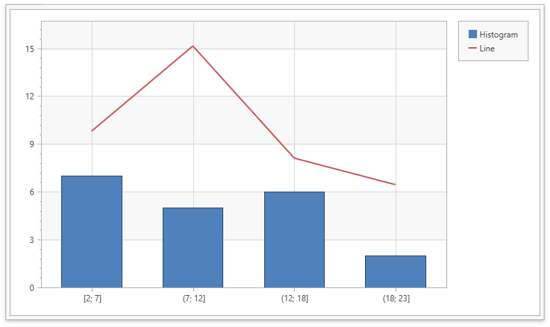

*Files to look at*:
- [MainWindow.xaml.cs](./CS/Chart%20Histogram%20WPF/MainWindow.xaml.cs) ([MainWindow.xaml.vb](./VB/Chart%20Histogram%20WPF/MainWindow.xaml.vb))
- [MainWindow.xaml](./CS/Chart%20Histogram%20WPF/MainWindow.xaml)

# How to Add a Line Series to a Histogram Chart

The following example shows how to plot a common XY series with a histogram in the same chart:

1. Create and configure histogram and line series.
2. Add a `ViewModel`and assign it to the [DataContext](https://docs.microsoft.com/en-us/dotnet/api/system.windows.frameworkelement.datacontext?view=net-5.0#System_Windows_FrameworkElement_DataContext) property. 
2. Use the [Series.DataSource](https://docs.devexpress.com/WPF/DevExpress.Xpf.Charts.Series.DataSource) property to bind series to an observable collection from the `ViewModel`.

## Documentation

- [Histogram](https://docs.devexpress.com/WPF/400974/controls-and-libraries/charts-suite/chart-control/histogram?p=netframework)
