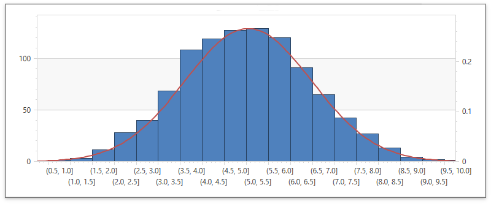

*Files to look at*:
- [Window1.xaml.cs](./CS//Window1.xaml.cs) ([Window1.xaml.vb](./VB//Window1.xaml.vb))
- [Window1.xaml](./CS//Window1.xaml)

# How to Plot a Common XY Series with a Histogram in the WPF Chart

The following example shows how to plot a common XY series with a histogram in the same chart:

In this example, an XY series range on the secondary axis aligns with a histogram on the primary axis. 

## Documentation

- [Histogram](https://docs.devexpress.com/WPF/400974/controls-and-libraries/charts-suite/chart-control/histogram?p=netframework)
